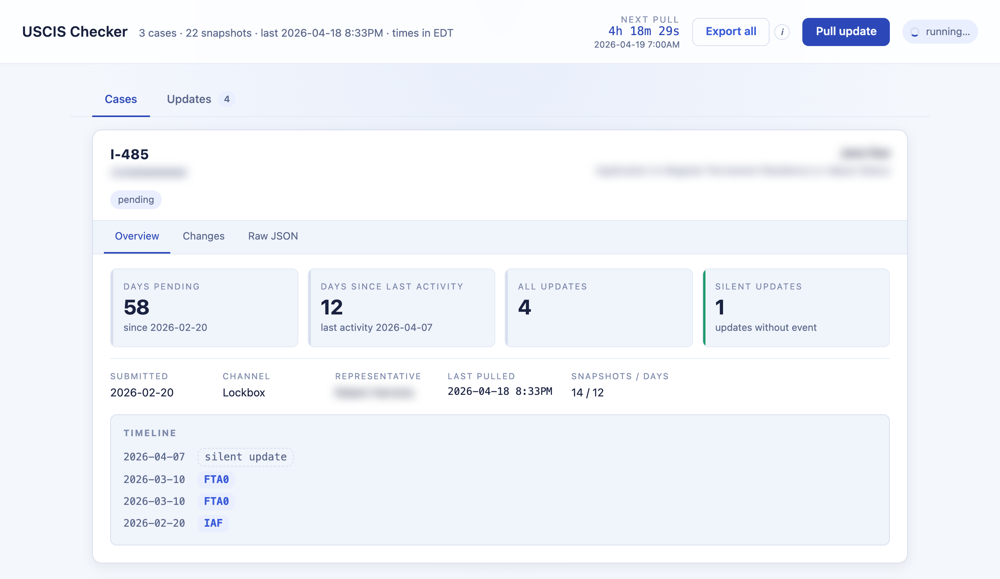
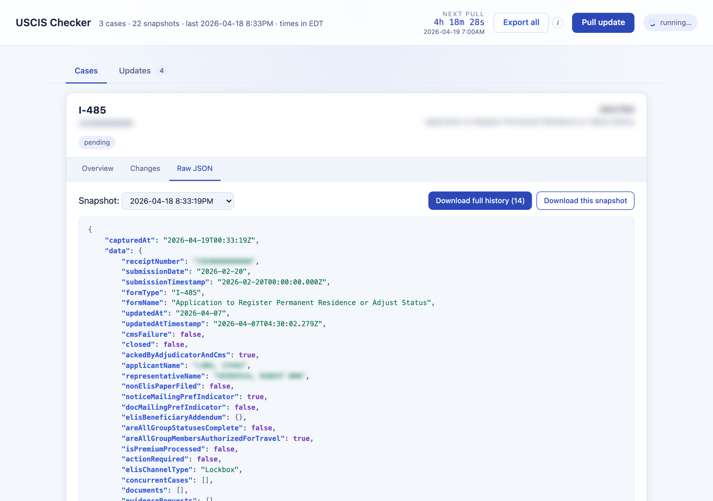
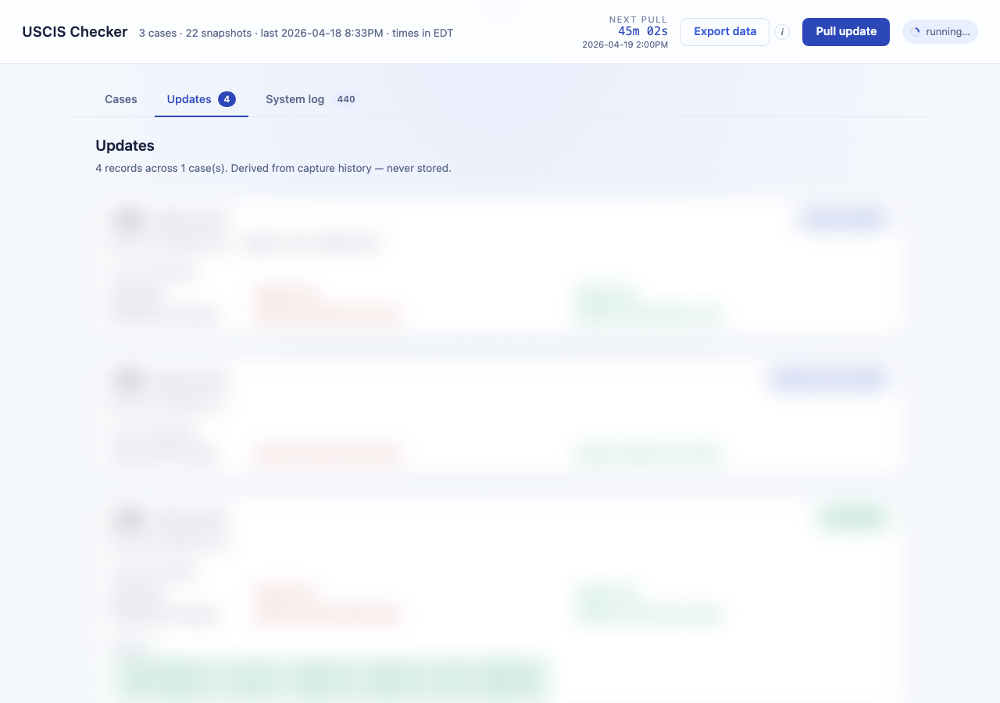
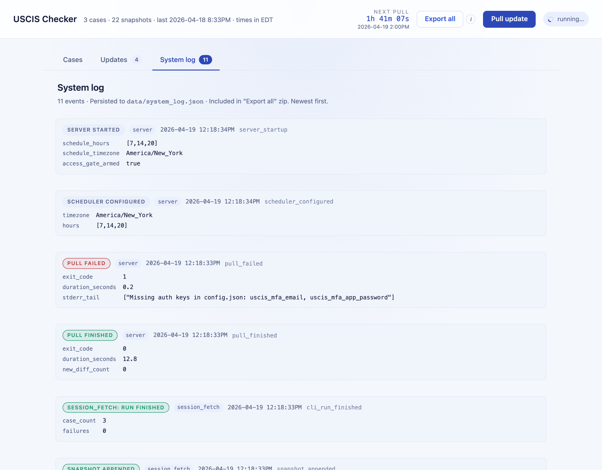

# USCIS Case Prober

**Pulls the real USCIS API 3×/day and diffs snapshots** to catch the
silent `updatedAt` bumps and event-code changes that public status
checkers miss. Self-hosted, one config file.

### vs. other case checkers

- **Real API, not scraped status.** Calls
  `/case-service/api/cases/{id}` and logs full snapshots.
- **Authenticates with your USCIS login.** Playwright-driven sign-in;
  MFA code auto-read from your inbox. No manual steps after setup.
- **Pulls 3×/day, keeps the full history.** Every snapshot is appended
  to disk — nothing overwritten. Diffs are recomputed from the full
  capture history on demand.
- **Catches silent updates.** Internal `updatedAt` bumps that never
  show up in the public status.
- **Runs on your machine, easily deployable.** `python src/server.py`
  locally, or drop it on a $15/month AWS/Azure VM. No SaaS.

---

## Screenshots

Dashboard — single-case overview. Hero metrics, factual sub-facts, and
a combined timeline (USCIS event codes + silent updates, newest first).
No stage inference, no community folklore — form-agnostic:



Raw JSON — full USCIS payload, pretty-printed with 4-space indentation
and syntax highlighting (original field order preserved, no re-sorting):



Updates feed — every diff across every case, newest first:



System log — structured event history of what the tracker did
(scheduler fires, pull lifecycle, snapshot appends, notifications).
Persisted to `data/system_log.json` and included in the export zip:



> Receipt numbers and representative names are blurred / redacted in
> the shots above. The live dashboard shows full case details.

---

## Quick start

```bash
git clone https://github.com/<you>/uscis-case-prober.git && cd uscis-case-prober
python3 -m venv venv && source venv/bin/activate
pip install -r requirements.txt
playwright install chromium

cp config.example.json config.json
# fill in config.json — full field reference + app-password walkthrough
# is in [Setup → Configure](#4-configure)

python src/server.py
# open http://127.0.0.1:8080
```

After cloning, **one file** is all you touch: `config.json` (gitignored).
See [Setup → Configure](#4-configure) for the full field reference and
[Setup → Obtain an app password](#3-obtain-an-app-password) for how to
get the credentials your email provider needs.

---

## How it works

**Core principle: snapshot everything, diff nothing away.**

- **Each snapshot is the full API payload**, not a summary string.
  One row per pull in `data/{formNum}_logs.json`, ISO-8601 timestamped.
  No row is ever deleted or overwritten.
- **Diffs are recomputed on the fly** from that append-only history.
  Restart, reboot, code change — never loses a record, never
  double-counts one.
- **Every change gets classified.** `event` (new case event — FTA0,
  APR0, etc.), `notice` (Request for Evidence / receipt / appointment
  letter), `appointment` (biometrics rescheduled), `decision`
  (`closed` / `actionRequired` flipped), `silent_update` (`updatedAt`
  date advanced with nothing else visible), or `same_day_refresh`
  (same-day re-stamp, sync artifact).
- **Email notifications.** One email per new diff per pull. Before /
  after diff-ID snapshotting around each pull → no duplicates, no
  misses, survives restarts.
- **One-click export.** `/api/export` (or the "Export all" button)
  bundles every `data/*_logs.json` plus a manifest into a timestamped
  zip. Useful for sharing with a lawyer or archiving.

### Design invariants (don't break these)

- `config.json`, `data/*.json`, `.uscis_session.json`, and
  `.flask_secret` are **gitignored**. Never commit them.
- `uscis_auth.py` is the **only** module allowed to trigger MFA.
  Fetch / extract code paths must never call the login flow directly.
- All timestamps in snapshot logs are ISO-8601 UTC. Display-time
  localisation happens in the browser only.
- Chromium stays out of the Flask process — each pull is a separate
  subprocess so the web server never manages Playwright lifetimes.

---

## Setup

### 1. Prerequisites

- Python 3.10 or newer
- A system that can run headless Chromium (macOS, Linux, WSL)
- Outbound network to `my.uscis.gov` and your email provider's
  IMAP (993) + SMTP (587) endpoints — see the provider table below

```bash
python3 --version            # must be >= 3.10
command -v git >/dev/null    # must exist
```

### 2. Install

```bash
python3 -m venv venv
source venv/bin/activate
pip install --upgrade pip
pip install -r requirements.txt
playwright install chromium
```

Verify:

```bash
python -c "import flask, apscheduler, playwright"   # silent on success
playwright --version                                 # prints a version
```

### 3. Obtain an app password

An **app password** is a scoped credential (usually 16 characters) your
email provider issues for IMAP/SMTP access by third-party programs. It
is *not* your regular account password.

**Why:** once MFA / 2FA is on (effectively mandatory for all modern
providers), your regular password stops working for IMAP/SMTP. The
provider expects an app password instead. Properties:

- Scoped to mail only — can't log into the web UI, read chat, etc.
- Individually revocable — delete just the tracker's password without
  touching anything else.
- Displayed exactly once on creation. Copy it immediately.

The tracker stores it in `config.json` and uses it to:

1. Read the USCIS MFA email over IMAP to get the 6-digit code.
2. Send diff-notification emails over SMTP.

IMAP/SMTP hosts are auto-detected from your email domain (see
`src/providers.py`), so you never enter them. Supported out of the box:

<details>
<summary><strong>Gmail / Google Workspace</strong></summary>

1. Enable 2-Step Verification: <https://myaccount.google.com/security>
   → *2-Step Verification* → turn on.
2. Visit <https://myaccount.google.com/apppasswords>.
3. In *App name* type something like `USCIS tracker`, click *Create*.
4. Copy the 16-character string (spaces are ignored).
5. Enable IMAP in Gmail: *Settings → See all settings →
   Forwarding and POP/IMAP → IMAP access: Enable*.
</details>

<details>
<summary><strong>Outlook / Hotmail / Microsoft 365</strong></summary>

1. Sign in at <https://account.microsoft.com/security>.
2. *Security dashboard → Advanced security options → App passwords →
   Create a new app password*.
3. Copy the generated password.
4. MFA must be on; Microsoft will prompt you to enable it otherwise.
</details>

<details>
<summary><strong>iCloud Mail</strong></summary>

1. Sign in at <https://appleid.apple.com>.
2. *Sign-In and Security → App-Specific Passwords → Generate an
   app-specific password*.
3. Enter a label (e.g. `USCIS tracker`), copy the 16-character password.
4. MFA is required — Apple won't show this option otherwise.
</details>

<details>
<summary><strong>Yahoo Mail</strong></summary>

1. Sign in at <https://login.yahoo.com/account/security>.
2. Enable *2-Step Verification* if off.
3. *Generate app password → Other app*, name it `USCIS tracker`, click
   *Generate*.
4. Copy the password.
</details>

<details>
<summary><strong>Fastmail</strong></summary>

1. <https://app.fastmail.com/settings/security/passwords>.
2. *New App Password*. Scope: *IMAP & SMTP*. Label it `USCIS tracker`.
3. Copy the password.
</details>

Using a provider not listed above? Add one line to `src/providers.py`
with its IMAP/SMTP hosts; no config-schema change needed. Any provider
offering IMAP + SMTP-with-STARTTLS + app passwords will work.

### 4. Configure

```bash
cp config.example.json config.json
```

Fill in `config.json`:

```json
{
  "cases": [
    { "id": "IOE0000000001", "label": "I-485" },
    { "id": "IOE0000000002", "label": "I-765" },
    { "id": "IOE0000000003", "label": "I-131" }
  ],
  "auth": {
    "uscis_email":            "you@example.com",
    "uscis_password":         "your-uscis-password",
    "uscis_mfa_email":        "you@example.com",
    "uscis_mfa_app_password": "16charapppassword",
    "optional_access_code":   "",
    "notification_email":     ""
  }
}
```

| Field | Required? | Value |
|---|---|---|
| `cases[].id` | yes | USCIS receipt number (`IOE…`). One entry per case to track. |
| `cases[].label` | yes | Short label shown in the UI (e.g. `I-485`). Must contain a form number. |
| `auth.uscis_email` / `uscis_password` | yes | `my.uscis.gov` login. |
| `auth.uscis_mfa_email` | yes | Inbox where USCIS MFA emails land. Any major provider. |
| `auth.uscis_mfa_app_password` | yes | App password for that inbox (see Step 3). |
| `auth.optional_access_code` | no | Recommended when deployed remotely. When non-empty, dashboard requires this code to view. |
| `auth.notification_email` | no | Override recipient for diff-update emails. Defaults to `uscis_mfa_email`. |

Verify:

```bash
python -c "import json; c=json.load(open('config.json')); \
  assert c['auth']['uscis_email'] and c['auth']['uscis_mfa_app_password'], \
  'auth fields are empty'; \
  assert c['cases'], 'no cases configured'; \
  print('config ok:', len(c['cases']), 'case(s)')"
```

---

## Running locally

### 1. Run the tests

```bash
pytest -q
```

Expected: `200+ passed`, 100% line coverage across `src/`. Any failure
here means a dependency / install issue — fix it before moving on.

### 2. First login (one-off; triggers an MFA email)

```bash
python src/session_fetch.py login
```

Headless Chromium signs in to `my.uscis.gov`, polls your inbox for the
MFA code, and saves the session to `.uscis_session.json`. Subsequent
pulls reuse that session and skip MFA for ~24 h.

```bash
ls -la .uscis_session.json        # must exist and be non-empty
```

### 3. Test one pull

```bash
python src/session_fetch.py extract
```

`extract` uses the saved session but **refuses** to re-login — safe to
iterate with without burning more MFA codes. Success writes one row
per case into `data/{formNum}_logs.json`.

```bash
ls data/*.json                    # one file per form number
python -c "import json; print('captures:', len(json.load(open('data/485_logs.json'))))"
```

### 4. Start the dashboard

```bash
python src/server.py
```

```
... INFO server: Scheduler started: daily pulls at 07:00, 14:00, 20:00 (America/New_York)
 * Running on http://127.0.0.1:8080
```

Open <http://127.0.0.1:8080>. Cases render with Overview / Timeline /
Changes / Raw JSON tabs, plus a global Updates feed. Pulls run on the
schedule; click **Pull update** for an ad-hoc probe; **Export all**
downloads the full zip archive.

### Troubleshooting

| Symptom | Fix |
|---|---|
| `Missing auth keys in config.json` | A required `auth` field is empty. All four credential fields must be set. |
| `No USCIS MFA code … within 180s` | IMAP didn't see the email. Verify the app password works (paste into any IMAP client), IMAP access is on, and the USCIS email actually arrived. |
| `AuthError: Session is stale and allow_login=False` | Run `python src/session_fetch.py login` to refresh. |
| `HTTP 429` on `/api/login` | Brute-force guard tripped. Wait 5 min per IP, or restart the server to reset. |
| Dashboard shows no cases | Check `data/*_logs.json` exists. If empty, the pull step didn't populate them. |

---

## Deployment (Azure VM + Caddy + CI/CD)

Optional — skip if you're running only locally.

### 1. Create the VM

```bash
RG=rg-uscis-checker
az group create --name $RG --location eastus2

ssh-keygen -t ed25519 -f ~/.ssh/uscis_checker -N ""

az vm create \
  --resource-group $RG \
  --name uscis-checker-vm \
  --image Canonical:0001-com-ubuntu-server-jammy:22_04-lts-gen2:latest \
  --size Standard_B1ms \
  --admin-username azureuser \
  --ssh-key-values ~/.ssh/uscis_checker.pub \
  --public-ip-sku Standard \
  --storage-sku StandardSSD_LRS \
  --os-disk-size-gb 30 \
  --nsg-rule SSH

# Optional friendly DNS
az network public-ip update \
  --resource-group $RG \
  --name uscis-checker-vmPublicIP \
  --dns-name <label>   # → <label>.eastus2.cloudapp.azure.com
```

### 2. First-time provisioning on the VM

```bash
sudo apt-get update
sudo apt-get install -y python3-venv git caddy
ssh-keygen -t ed25519 -f ~/.ssh/github_deploy -N ""
cat ~/.ssh/github_deploy.pub     # save for step 3

cat >> ~/.ssh/config <<'EOF'
Host github.com
  IdentityFile ~/.ssh/github_deploy
  IdentitiesOnly yes
EOF

git clone git@github.com:<you>/<repo>.git ~/uscis-checker
cd ~/uscis-checker
python3 -m venv venv
source venv/bin/activate
pip install -r requirements.txt
playwright install chromium

cp config.example.json config.json
# edit config.json — set auth.optional_access_code to a random string
# (strongly recommended when the server is reachable from the internet)

# systemd unit
sudo tee /etc/systemd/system/uscis-checker.service <<'EOF'
[Unit]
Description=USCIS Case Prober dashboard
After=network-online.target

[Service]
Type=simple
User=azureuser
WorkingDirectory=/home/azureuser/uscis-checker
ExecStart=/home/azureuser/uscis-checker/venv/bin/python src/server.py
Restart=on-failure

[Install]
WantedBy=multi-user.target
EOF
sudo systemctl enable --now uscis-checker

# Caddy reverse proxy (automatic HTTPS via Let's Encrypt)
sudo tee /etc/caddy/Caddyfile <<'EOF'
<your-hostname> {
    encode zstd gzip
    reverse_proxy 127.0.0.1:8080
}
EOF
sudo systemctl restart caddy
```

Open ports 80 + 443 in the Azure NSG; keep 8080 closed to the public
so traffic only reaches Flask through Caddy.

### 3. Register the VM's deploy key on GitHub

Back on your laptop (`gh` CLI installed):

```bash
gh repo deploy-key add <(ssh $VM 'cat ~/.ssh/github_deploy.pub') \
  --repo <you>/<repo> --title "uscis-checker-vm"
```

### 4. Add GitHub Actions secrets

| Secret | Value |
|---|---|
| `VM_HOST` | Public IP or DNS of the VM |
| `VM_USER` | SSH login (`azureuser` by default) |
| `VM_SSH_KEY` | **Private** SSH key reaching the VM (`~/.ssh/uscis_checker`) |

```bash
gh secret set VM_HOST --repo <you>/<repo> --body "<ip-or-host>"
gh secret set VM_USER --repo <you>/<repo> --body "azureuser"
gh secret set VM_SSH_KEY --repo <you>/<repo> < ~/.ssh/uscis_checker
```

After this, every push to `main` runs tests → SSHes to the VM →
`git reset --hard origin/main` → reinstalls deps if `requirements.txt`
changed → restarts the systemd unit → smoke-checks `/login`.

---

## Reference

### Project layout

```
src/
├── server.py          Flask app + scheduler. Entry point.
├── session_fetch.py   CLI: `run` / `login` / `extract`. Spawned as a
│                      subprocess by server.py on schedule / button.
├── uscis_auth.py      OpenID Connect + MFA login flow. The *only* module
│                      that burns an MFA code.
├── uscis_api.py       /cases/{id} navigation inside an authenticated tab.
├── mfa_mailbox.py     Polls IMAP for the USCIS MFA code. Provider-
│                      agnostic — host auto-selected from email domain.
├── providers.py       Email-domain → IMAP/SMTP host lookup.
├── diff_utils.py      Pure functions: day-bin, classify diff, infer
│                      stage, summarize case. Fully recomputable.
├── access_gate.py     Optional session-cookie gate + brute-force guard.
├── mailer.py          Email formatting + SMTP send (any provider).
└── static/            Dashboard UI (index.html + app.js + style.css).

tests/                 pytest — 100% line coverage on src/.
data/                  Snapshot logs. Gitignored.
config.json            Your secrets. Gitignored.
config.example.json    Template.
```

### UI & operational features

Beyond the snapshot/diff core:

- **Dashboard views.** Per-case Overview, Timeline, Changes, Raw JSON
  tabs; a global Updates feed; live countdown to the next scheduled
  pull.
- **Login isolation.** `uscis_auth.py` is the only module that burns an
  MFA code. `extract` refuses to log in — safe for iterating on
  scraping logic without spamming your inbox.
- **Optional access gate.** Signed session cookie, constant-time code
  comparison, 5-per-5-min brute-force guard, 30-day lifetime. The
  secret key is derived from `optional_access_code` — rotating the
  code invalidates every existing session on restart.
- **CI/CD.** GitHub Actions runs `pytest` on every push/PR; on `main`
  it SSHes to the VM, `git reset --hard`s, restarts the systemd unit,
  and smoke-checks `/login`.

### Configuration (`config.json`)

One file. Gitignored. Minimum viable shape:

```json
{
  "cases": [
    { "id": "IOE…", "label": "I-485" }
  ],
  "auth": {
    "uscis_email":            "…",
    "uscis_password":         "…",
    "uscis_mfa_email":        "…",
    "uscis_mfa_app_password": "…"
  }
}
```

See Setup → Configure for the full field table with optional overrides.

---

## License

No license set by default. Add one before publishing if you want others
to fork it explicitly.
