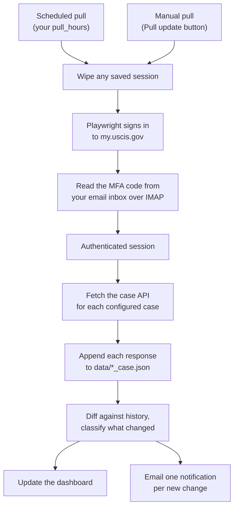

# USCIS Case Prober

[](LICENSE)

Self-hosted monitor for pending USCIS cases (I-485, I-765, I-131, and
any other `IOE…` receipt). It signs in with your own USCIS account,
pulls the **real case API** on a schedule you set, snapshots every
response, and diffs consecutive snapshots to surface changes the public
"Check Case Status" page never shows you — including silent internal
`updatedAt` bumps and new event codes.

One config file. No SaaS. Runs on your laptop or a cheap VM.

---

## Why this exists

The public USCIS status page shows a single plain-English sentence and
hides the machine-readable case record behind your login. That record
carries event codes, notice history, jurisdiction, and an internal
"last updated" timestamp that often moves **days before** the public
sentence changes — or moves without the sentence changing at all.

USCIS Case Prober captures that full record every pull and tells you the
moment anything shifts. Pulls run on the schedule you set, and a single
**Pull update** button lets you probe on demand — check right now,
anytime, without waiting for the next scheduled run.

---

## How it works

Every pull — scheduled or triggered by the **Pull update** button — runs
the same pipeline:



A few guarantees hold this together:

- **Append-only, diffed on the fly.** Snapshots are never overwritten;
  diffs are recomputed from the full history on every restart, so the
  system never loses a record or double-counts a change.
- **Every pull is a cold start.** The saved session is wiped before each
  run, so every pull exercises the full login + MFA flow. A login
  regression surfaces at the next pull, not days later when a stale
  cookie quietly expires.
- **Chromium runs out-of-process.** Each pull is a separate subprocess,
  so the web server never manages a browser lifetime.
- **Never commit secrets.** `config.json`, `data/*.json`,
  `.uscis_session.json`, and `.flask_secret` are gitignored. Only
  `uscis_auth.py` may trigger MFA.

---

## Features

- **Catches silent updates.** Internal `updatedAt` bumps that are
  invisible on the public page are flagged as a `silent_update`.
- **Full change classification.** Each diff is tagged `event` (new event
  code — FTA0, APR0, …), `notice` (RFE / receipt / appointment letter),
  `appointment` (biometrics rescheduled), `decision` (`closed` /
  `actionRequired` flipped), or `silent_update`.
- **Dashboard.** Per-case Overview / Updates / Raw JSON tabs, a global
  Updates feed, and a System tab with a storage breakdown, paginated
  event log, and a live countdown to the next pull.
- **Email alerts.** One email per new change, de-duplicated across
  restarts so nothing is re-sent or dropped.
- **Deep diagnostics.** Every pull records a native Playwright trace
  (DOM, network, console, screenshots), saved on failure — or on every
  pull in Debug mode — and replayable in the built-in viewer.
- **One-click export.** Bundle every case snapshot + manifest into a
  timestamped zip for a lawyer or your own archive.

---

## Quick start

```bash
git clone https://github.com/<you>/uscis-case-prober.git && cd uscis-case-prober
python3 -m venv venv && source venv/bin/activate
pip install -r requirements.txt
playwright install chromium

cp config.example.json config.json
# fill in config.json — see Setup → Configure below

python src/server.py
# open http://127.0.0.1:8080
```

After cloning, **one file** is all you touch: `config.json` (gitignored).
The [Setup](#setup) section walks through the app password and every
config field.

---

## How to run it

Three deployment shapes, in increasing order of exposure:

- **Completely local.** Run `python src/server.py` on your own machine
  and reach the dashboard at `http://127.0.0.1:8080`. Nothing is exposed
  to the network, so no password is needed. Simplest and most private —
  the good default.
- **Local with public exposure.** Run it locally but put it behind a
  tunnel or reverse proxy (Caddy, Cloudflare Tunnel, `ngrok`) to reach it
  from your phone or share it. The moment it's reachable off your machine,
  set `auth.admin_password`.
- **Remote deployment.** Run it on an always-on VM (see
  [Deployment](#deployment-azure-vm--caddy--cicd)) so pulls keep running
  whether your laptop is on or not. A remote server is internet-reachable,
  so `auth.admin_password` is **required**, not optional.

### Security

The dashboard exposes your real case data — names, receipt numbers,
notice history. On `127.0.0.1` that's fine; nothing off your machine can
reach it. **The moment it's reachable from anywhere else, set
`auth.admin_password`** to a random string. When non-empty, the site
requires that password to view, backed by a signed 30-day session cookie,
constant-time comparison, a brute-force guard (5 failed attempts per IP
per 5 minutes), and automatic session invalidation when you rotate the
password. A redaction toggle can also mask PII in the rendered view —
handy when sharing a screen.

---

## Setup

### 1. Prerequisites

Because the tracker signs in as **you** and pulls *your* case API, your
USCIS account and email must be set up so the server can log in
unattended:

1. **Your cases are tied to your USCIS account.** The receipts you want
   to track must appear when you sign in at `my.uscis.gov` — the case API
   is only reachable through your authenticated session.
2. **USCIS MFA is set to email.** Sign-in must challenge with a code sent
   to an email inbox (not SMS or an authenticator app), because the
   server reads that code from your mailbox automatically.
3. **An email app password for that inbox.** The server retrieves the MFA
   code over IMAP and sends notifications over SMTP using an app password
   (see [Step 3](#3-obtain-an-app-password)).

System requirements:

- Python 3.10 or newer
- A system that can run headless Chromium (macOS, Linux, WSL)
- Outbound network to `my.uscis.gov` and your email provider's IMAP
  (993) + SMTP (587) endpoints

### 2. Install

```bash
python3 -m venv venv
source venv/bin/activate
pip install --upgrade pip
pip install -r requirements.txt
playwright install chromium
```

Verify: `python -c "import flask, apscheduler, playwright"` (silent on
success) and `playwright --version`.

### 3. Obtain an app password

An **app password** is a scoped credential (usually 16 characters) your
email provider issues for IMAP/SMTP access by third-party programs — not
your regular account password. With MFA enabled (mandatory almost
everywhere now), your regular password no longer works for IMAP/SMTP; the
app password does. It's scoped to mail only, individually revocable, and
shown exactly once on creation, so copy it immediately.

The tracker stores it in `config.json` and uses it to (1) read the USCIS
MFA email over IMAP for the 6-digit code, and (2) send diff
notifications over SMTP. IMAP/SMTP hosts are auto-detected from your email
domain (see `src/providers.py`), so you never enter them. Supported out
of the box:

<details>
<summary><strong>Gmail / Google Workspace</strong></summary>

1. Enable 2-Step Verification: <https://myaccount.google.com/security>
   → *2-Step Verification* → turn on.
2. Visit <https://myaccount.google.com/apppasswords>.
3. In *App name* type something like `USCIS tracker`, click *Create*.
4. Copy the 16-character string (spaces are ignored).
5. Enable IMAP: *Settings → See all settings → Forwarding and POP/IMAP
   → IMAP access: Enable*.
</details>

<details>
<summary><strong>Outlook / Hotmail / Microsoft 365</strong></summary>

1. Sign in at <https://account.microsoft.com/security>.
2. *Security dashboard → Advanced security options → App passwords →
   Create a new app password*.
3. Copy the generated password.
4. MFA must be on; Microsoft will prompt you to enable it otherwise.
</details>

<details>
<summary><strong>iCloud Mail</strong></summary>

1. Sign in at <https://appleid.apple.com>.
2. *Sign-In and Security → App-Specific Passwords → Generate an
   app-specific password*.
3. Enter a label (e.g. `USCIS tracker`), copy the 16-character password.
4. MFA is required — Apple won't show this option otherwise.
</details>

<details>
<summary><strong>Yahoo Mail</strong></summary>

1. Sign in at <https://login.yahoo.com/account/security>.
2. Enable *2-Step Verification* if off.
3. *Generate app password → Other app*, name it `USCIS tracker`, click
   *Generate*.
4. Copy the password.
</details>

<details>
<summary><strong>Fastmail</strong></summary>

1. <https://app.fastmail.com/settings/security/passwords>.
2. *New App Password*. Scope: *IMAP & SMTP*. Label it `USCIS tracker`.
3. Copy the password.
</details>

Using a provider not listed? Add one line to `src/providers.py` with its
IMAP/SMTP hosts — no config-schema change needed. Any provider offering
IMAP + SMTP-with-STARTTLS + app passwords will work.

### 4. Configure

```bash
cp config.example.json config.json
```

Fill in `config.json`:

```json
{
  "cases": [
    { "id": "IOE0000000001", "label": "I-485" },
    { "id": "IOE0000000002", "label": "I-765" },
    { "id": "IOE0000000003", "label": "I-131" }
  ],
  "auth": {
    "uscis_email":            "you@example.com",
    "uscis_password":         "your-uscis-password",
    "uscis_mfa_email":        "you@example.com",
    "uscis_mfa_app_password": "16charapppassword",
    "admin_password":         "",
    "notification_email":     "",
    "notification_from_name": ""
  },
  "pull_hours": [0, 6, 10, 14, 18],
  "retry": 2,
  "retry_wait_seconds": 180
}
```

| Field | Required? | Value |
|---|---|---|
| `cases[].id` | yes | USCIS receipt number (`IOE…`). One entry per case to track. |
| `cases[].label` | yes | Short label shown in the UI (e.g. `I-485`). Must contain a form number. |
| `auth.uscis_email` / `uscis_password` | yes | Your `my.uscis.gov` login. |
| `auth.uscis_mfa_email` | yes | Inbox where USCIS MFA emails land. Any supported provider. |
| `auth.uscis_mfa_app_password` | yes | App password for that inbox (see Step 3). |
| `pull_hours` | yes | Automatic-pull schedule: non-empty array of integer hours (0–23, 24h America/New_York), normalised to sorted-unique. The starter `[0, 6, 10, 14, 18]` pulls five times daily, weighted toward US daytime. No default — you must set it. |
| `retry` | yes | Auth-failure retries per scheduled pull (int, ≥0). `2` is a good start. Only auth failures retry; timeouts and config errors do not. |
| `retry_wait_seconds` | yes | Wait between retries, in seconds (int, ≥0). `180` gives a transient anti-bot block time to clear. |
| `auth.admin_password` | no | Required once the dashboard is reachable off-machine (see [Security](#security)). When non-empty, the site requires this password to view. |
| `auth.notification_email` | no | Override recipient for diff emails. Defaults to `uscis_mfa_email`. |
| `auth.notification_from_name` | no | Display name on the diff emails. Defaults to `USCIS Prober`. |
| `trace_successful_pulls` | no | When `true`, every pull preserves its Playwright trace. Defaults to `false`; toggle live via the Debug-mode pill in the dashboard. |

Verify:

```bash
python -c "import json; c=json.load(open('config.json')); \
  assert c['auth']['uscis_email'] and c['auth']['uscis_mfa_app_password'], \
  'auth fields are empty'; \
  assert c['cases'], 'no cases configured'; \
  print('config ok:', len(c['cases']), 'case(s)')"
```

---

## Running locally

**Run the tests** (`pytest -q`) — expect `580+ passed`, 100% line
coverage on `src/`. A failure here is a dependency or install issue.

**First login** (one-off; triggers an MFA email):

```bash
python src/session_fetch.py login   # saves .uscis_session.json
```

**Test one pull** without burning a fresh MFA code:

```bash
python src/session_fetch.py extract   # reuses the session, refuses to re-login
```

`extract` is for debugging only. The production path is
`python src/session_fetch.py run` (called by `/api/pull` and the
scheduler; `fetch` is an alias), which wipes the session and does a full
cold-start login every time.

**Start the dashboard:**

```bash
python src/server.py
# ... Scheduler started: daily pulls at 00:00, 06:00, 10:00, 14:00, 18:00 (America/New_York)
#  * Running on http://127.0.0.1:8080
```

The listen port defaults to `8080`; override with `USCIS_PORT`. In the
dashboard, **Pull update** runs an ad-hoc probe, **Export data**
downloads the zip archive, and **Export log** (inside System) downloads
the system log plus every preserved trace.

### Troubleshooting

| Symptom | Fix |
|---|---|
| `Missing auth keys in config.json` | A required `auth` field is empty. All four credential fields must be set. |
| `No USCIS MFA code … within 180s` | IMAP didn't see the email. Verify the app password works (paste it into any IMAP client), IMAP access is enabled, and the USCIS email actually arrived. |
| `AuthError: Session is stale and allow_login=False` | Run `python src/session_fetch.py login` to refresh. |
| `HTTP 429` on `/api/login` | Brute-force guard tripped. Wait 5 min per IP, or restart the server to reset. |
| Dashboard shows no cases | Check `data/*_case.json` exists. If empty, the pull step didn't populate it. |

---

## Deployment (Azure VM + Caddy + CI/CD)

Optional — skip if you're running only locally.

> [!WARNING]
> **Two instances on the same USCIS account must never fire a scheduled
> pull at the same time.** Two processes hitting the OIDC + MFA flow
> within seconds of each other will race for the same MFA email,
> invalidate each other's session, and can trip rate limits or lockouts.
> Either stop all but one before the next scheduled hour, or give each
> `config.json` non-overlapping `pull_hours` (e.g. VM `[6]`, local `[7]`).
> Manual `/api/pull` triggers are fine to interleave.

### 1. Create the VM

```bash
RG=rg-uscis-checker
az group create --name $RG --location eastus2

ssh-keygen -t ed25519 -f ~/.ssh/uscis_checker -N ""

az vm create \
  --resource-group $RG \
  --name uscis-checker-vm \
  --image Canonical:0001-com-ubuntu-server-jammy:22_04-lts-gen2:latest \
  --size Standard_B1ms \
  --admin-username azureuser \
  --ssh-key-values ~/.ssh/uscis_checker.pub \
  --public-ip-sku Standard \
  --storage-sku StandardSSD_LRS \
  --os-disk-size-gb 30 \
  --nsg-rule SSH

# Optional friendly DNS
az network public-ip update \
  --resource-group $RG \
  --name uscis-checker-vmPublicIP \
  --dns-name <label>   # → <label>.eastus2.cloudapp.azure.com
```

### 2. First-time provisioning on the VM

```bash
sudo apt-get update
sudo apt-get install -y python3-venv git caddy
ssh-keygen -t ed25519 -f ~/.ssh/github_deploy -N ""
cat ~/.ssh/github_deploy.pub     # save for step 3

cat >> ~/.ssh/config <<'EOF'
Host github.com
  IdentityFile ~/.ssh/github_deploy
  IdentitiesOnly yes
EOF

git clone git@github.com:<you>/<repo>.git ~/uscis-checker
cd ~/uscis-checker
python3 -m venv venv
source venv/bin/activate
pip install -r requirements.txt
playwright install chromium

cp config.example.json config.json
# edit config.json — set auth.admin_password to a random string

# systemd unit
sudo tee /etc/systemd/system/uscis-checker.service <<'EOF'
[Unit]
Description=USCIS Case Prober dashboard
After=network-online.target

[Service]
Type=simple
User=azureuser
WorkingDirectory=/home/azureuser/uscis-checker
ExecStart=/home/azureuser/uscis-checker/venv/bin/python src/server.py
Restart=on-failure

[Install]
WantedBy=multi-user.target
EOF
sudo systemctl enable --now uscis-checker

# Caddy reverse proxy (automatic HTTPS via Let's Encrypt)
sudo tee /etc/caddy/Caddyfile <<'EOF'
<your-hostname> {
    encode zstd gzip
    reverse_proxy 127.0.0.1:8080
}
EOF
sudo systemctl restart caddy
```

Open ports 80 + 443 in the Azure NSG; keep 8080 closed to the public so
traffic only reaches Flask through Caddy.

### 3. Register the VM's deploy key on GitHub

Back on your laptop (`gh` CLI installed):

```bash
gh repo deploy-key add <(ssh $VM 'cat ~/.ssh/github_deploy.pub') \
  --repo <you>/<repo> --title "uscis-checker-vm"
```

### 4. Add GitHub Actions secrets

| Secret | Value |
|---|---|
| `VM_HOST` | Public IP or DNS of the VM |
| `VM_USER` | SSH login (`azureuser` by default) |
| `VM_SSH_KEY` | **Private** SSH key reaching the VM (`~/.ssh/uscis_checker`) |

```bash
gh secret set VM_HOST --repo <you>/<repo> --body "<ip-or-host>"
gh secret set VM_USER --repo <you>/<repo> --body "azureuser"
gh secret set VM_SSH_KEY --repo <you>/<repo> < ~/.ssh/uscis_checker
```

After this, every push to `main` runs the test suite → SSHes to the VM →
`git reset --hard origin/main` → reinstalls deps if `requirements.txt`
changed → restarts the systemd unit → smoke-checks `/login`.

---

## Reference

### Project layout

```
src/
├── server.py          Flask app + scheduler + build-version resolver.
│                      Spawns session_fetch, collects its events, writes
│                      one consolidated `pull` log row.
├── session_fetch.py   CLI: run / fetch / login / extract. Writes snapshots.
├── uscis_auth.py      OpenID Connect + MFA login. Only module that burns
│                      an MFA code.
├── uscis_api.py       Case endpoint (`/cases/{id}`), in an auth'd tab.
├── uscis_status.py    Public status endpoint (statusTitle / statusText).
├── mfa_mailbox.py     Polls IMAP for the MFA code. Provider-agnostic.
├── providers.py       Email-domain → IMAP/SMTP host lookup.
├── diff_utils.py      Pure functions: day-bin, classify diff, summarize.
├── access_gate.py     Optional session-cookie gate + brute-force guard.
├── mailer.py          Email formatting + SMTP send.
├── event_links.py     Relates events across snapshots for the timeline.
├── redaction.py       Server-side PII redaction for the dashboard.
├── system_log.py      Append-only event store. Powers the System tab.
└── static/            Dashboard UI (index.html + app.js + style.css).

tests/                 pytest — 580+ tests, 100% line coverage on src/.
data/                  Snapshot logs. Gitignored.
  {num}_case.json      Case-API snapshot history per form.
  {num}_status.json    Latest human-readable status (overwritten each pull).
  system_log.json      Structured event log (rotates at 5000 entries).
config.json            Your secrets. Gitignored.
config.example.json    Template.
```

### HTTP API

| Route | Method | Purpose |
|---|---|---|
| `/` | GET | Dashboard SPA. |
| `/api/cases` | GET | All configured cases with current state. |
| `/api/cases/<label>/history` | GET | Full snapshot + diff history for one case. |
| `/api/updates` | GET | Global diff feed across every case. |
| `/api/pull` | POST | Trigger an ad-hoc pull. |
| `/api/pull/status` | GET | Pull-in-progress state + next scheduled fire. |
| `/api/export` | GET | Zip of every case snapshot + manifest. |
| `/api/storage` | GET | Per-case + system-log storage breakdown. |
| `/api/system-log` | GET | Paginated event log. |
| `/api/system-log/export` | GET | System log + every preserved trace, zipped. |
| `/api/redaction-mode` | GET/POST | Read / toggle dashboard PII redaction. |
| `/api/debug-mode` | GET/POST | Read / toggle `trace_successful_pulls` live. |
| `/api/version` | GET | Running commit SHA + authored time + sortable label. |
| `/login`, `/api/login`, `/api/logout`, `/api/auth/status` | — | Access gate (present only when `admin_password` is set). |

### CI/CD

GitHub Actions runs the full pytest suite (Python 3.11, Node 22 for the
DOM tests) on every push and pull request. On `main`, it additionally
deploys to the VM and smoke-checks `/login`. `GET /api/version` returns
the running commit and a sortable build label for deploy verification.

---

## License

**GNU Affero General Public License v3.0 or later (AGPL-3.0-or-later).**
See [LICENSE](LICENSE) for the full text.

Copyright (C) 2026 the USCIS Prober contributors.

Short version: you're free to use, modify, and redistribute this code. If
you deploy a **modified** version — including as a network service your
users reach over the internet — you must make the modified source
available to those users under the same license. Keeping this project and
any derivatives open is the point.

There is **no warranty**. See sections 15 and 16 of the license.
